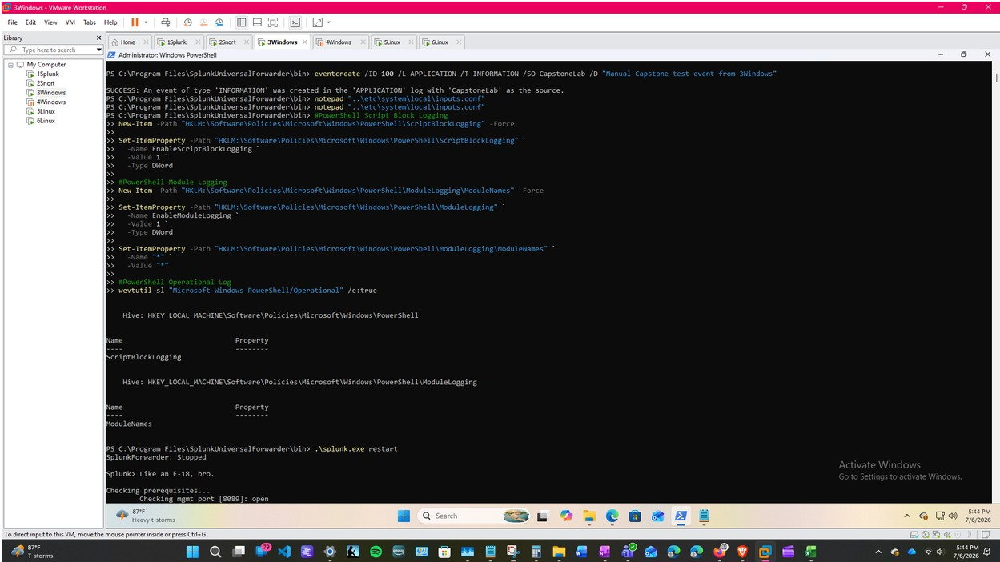

# Enable PowerShell Script Block Logging
New-Item -Path "HKLM:\Software\Policies\Microsoft\Windows\PowerShell\ScriptBlockLogging" -Force

Set-ItemProperty -Path "HKLM:\Software\Policies\Microsoft\Windows\PowerShell\ScriptBlockLogging" `
  -Name EnableScriptBlockLogging `
  -Value 1 `
  -Type DWord

# Enable PowerShell Module Logging
New-Item -Path "HKLM:\Software\Policies\Microsoft\Windows\PowerShell\ModuleLogging\ModuleNames" -Force

Set-ItemProperty -Path "HKLM:\Software\Policies\Microsoft\Windows\PowerShell\ModuleLogging" `
  -Name EnableModuleLogging `
  -Value 1 `
  -Type DWord

Set-ItemProperty -Path "HKLM:\Software\Policies\Microsoft\Windows\PowerShell\ModuleLogging\ModuleNames" `
  -Name "*" `
  -Value "*"

*Figure 10. PowerShell Module Logging enabled on `3Windows` to increase visibility into executed PowerShell activity.*

# Enable PowerShell Operational log
wevtutil sl "Microsoft-Windows-PowerShell/Operational" /e:true

---

### *About This Project*

**Created by Molly Bentley Ussery | Senior Capstone Project | July 2026**

This project documents hands-on cybersecurity work completed in a six-system Splunk + Snort SOC lab, including security monitoring, detection, attack simulation, investigation, and analyst documentation.

🔗 **Quick Links** *| [Cybersecurity Portfolio](https://mbbu-beep.github.io/) | [Project Home](https://github.com/mbbu-beep/splunk-snort-soc-lab) | [Video Demo](https://github.com/mbbu-beep/splunk-snort-soc-lab/blob/main/documentation/video-demo.md) | [Cybersecurity Insights](https://github.com/mbbu-beep/cybersecurity-insights) | [LinkedIn](https://www.linkedin.com/in/mollybbussery/) |* 🔒

