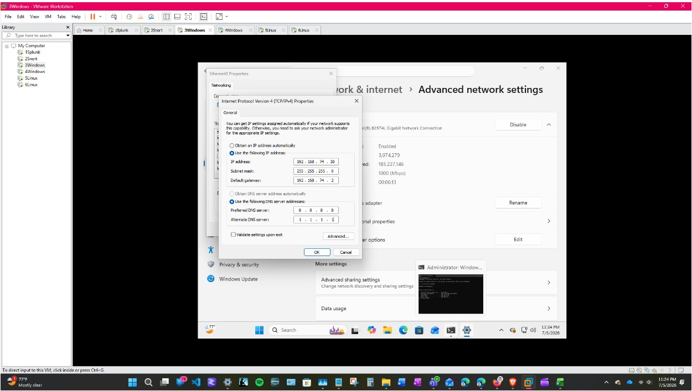
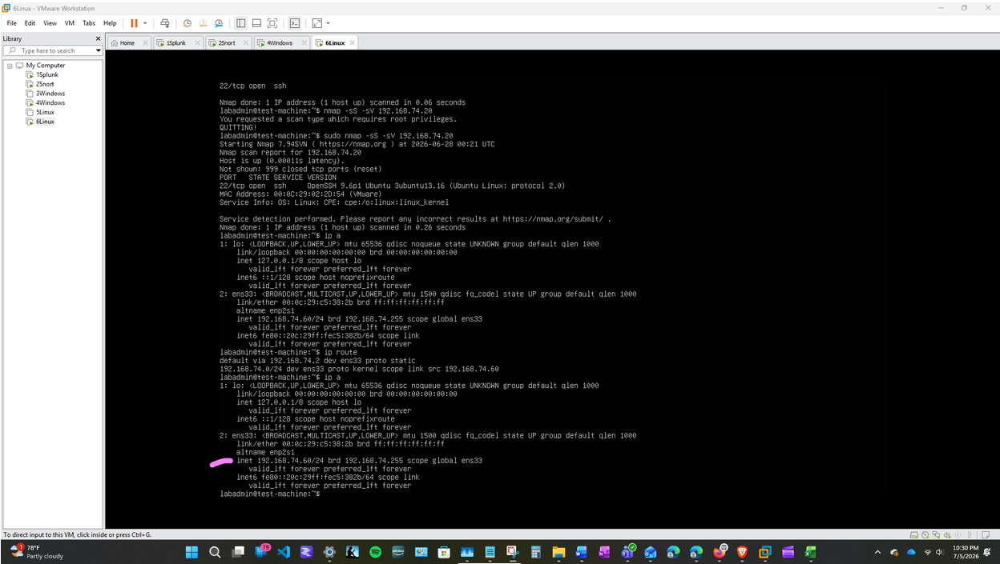

# Lab Architecture

## Overview

The project was built as a six-machine virtual environment in VMware Workstation.

Each virtual machine was assigned a specific role within the lab so that Windows, Linux, network, and intrusion-detection data could be generated and reviewed through a central Splunk server.

The systems communicated through an isolated VMware NAT network using static IP addresses.

**Quick Links:** *| [Project Overview](project-overview.md) | [Lab Architecture](architecture.md) | [Log Sources](log-sources.md) | [Video Demonstration](video-demo.md) |*


## Virtual Machines

| System | Operating System | Role | IP Address |
|---|---|---|---|
| `1Splunk` | Ubuntu Linux | Central Splunk server and SIEM platform | `192.168.74.10` |
| `2Snort` | Ubuntu Linux | Snort intrusion detection sensor | `192.168.74.20` |
| `3Windows` | Windows | User workstation and Windows event source | `192.168.74.30` |
| `4Windows` | Windows Server | Server and domain-related Windows system | `192.168.74.40` |
| `5Linux` | Ubuntu Linux | Linux endpoint and log source | `192.168.74.50` |
| `6Linux` | Ubuntu Linux | Attack simulation and testing machine | `192.168.74.60` |


## Network Layout

```text
                                       VMware NAT Network
                                        192.168.74.0/24
                                                |
        -------------------------------------------------------------------------------------
        |                  |               |                 |               |              |
    1Splunk             2Snort         3Windows          4Windows        5Linux          6Linux
  192.168.74.10          .20             .30               .40             .50             .60
```

## Static IP Configuration



*Figure 1. Static IP configuration for the 3Windows workstation.*



*Figure 2. Static IP configuration for the 6Linux testing machine.*


## Log Collection Flow

The Splunk server acted as the central destination for log data generated throughout the environment.

```text
2Snort ─────────────────┐ 
Snort alert log         |
                        |
3Windows ───────────────|
Windows logs            |
PowerShell logs         |
                        |──> Splunk Universal Forwarders
4Windows ───────────────|         send data to
Windows logs            |         1Splunk:9997
                        |
5Linux ─────────────────|
Linux auth.log          |
Linux syslog            |
                        |
6Linux ─────────────────┘
Linux and test activity
```

The Splunk Universal Forwarders sent collected events to:

```text
192.168.74.10:9997
```


## Splunk Indexes

| Index | Data Collected |
|---|---|
| `windows` | Windows Event Logs and PowerShell activity |
| `linux` | Linux authentication and system logs |
| `network` | Snort alerts and network-related events |


## Log Sources

The primary log sources included:

| Source System | Log Source |
|---|---|
| `2Snort` | `/var/log/snort/alert` |
| `3Windows` | Windows Application Log |
| `3Windows` | Windows Security Log |
| `3Windows` | PowerShell Operational Log |
| `4Windows` | Windows event data |
| `5Linux` | `/var/log/auth.log` |
| `5Linux` | `/var/log/syslog` |
| `6Linux` | Linux authentication and system activity |


## Security Testing Flow

The lab was designed so that controlled activity could be generated on one system and reviewed from another.

Examples included:

```text
6Linux
   |
   |-- Nmap port scan
   |-- Network traffic
   |-- Authentication testing
   v
5Linux / 2Snort
   |
   |-- Linux logs
   |-- Snort alerts
   v
1Splunk
   |
   |-- Search
   |-- Validate
   |-- Analyze
```

Windows activity followed a similar process:

```text
3Windows
   |
   |-- Failed login attempts
   |-- PowerShell commands
   |-- Account modifications
   |-- File activity
   v
Windows Event Logs
   |
   v
Splunk Universal Forwarder
   |
   v
1Splunk
```


## Design Purpose

The architecture was designed to demonstrate the full event-monitoring process:

1. Security activity occurs on an endpoint or across the network.
2. The operating system or Snort generates a log or alert.
3. A Splunk Universal Forwarder collects the data.
4. The event is sent to the Splunk server.
5. Splunk stores the event in the appropriate index.
6. The activity is searched, reviewed, and interpreted from a security analyst perspective.


## Future Expansion

The environment can be expanded to include:

- Additional Windows Server and Active Directory testing
- Expanded use of `4Windows`
- New Snort detection rules
- Splunk dashboards and alerts
- Additional attack simulations
- Incident-response playbooks
- Correlation searches across Windows, Linux, and network data

