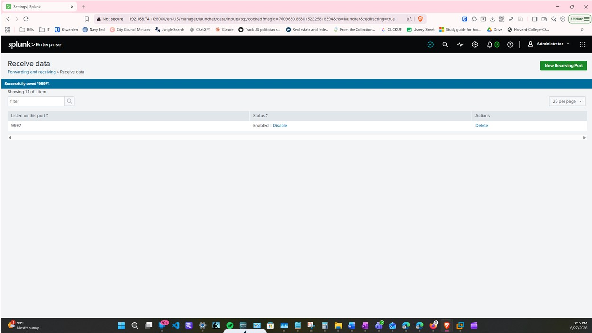
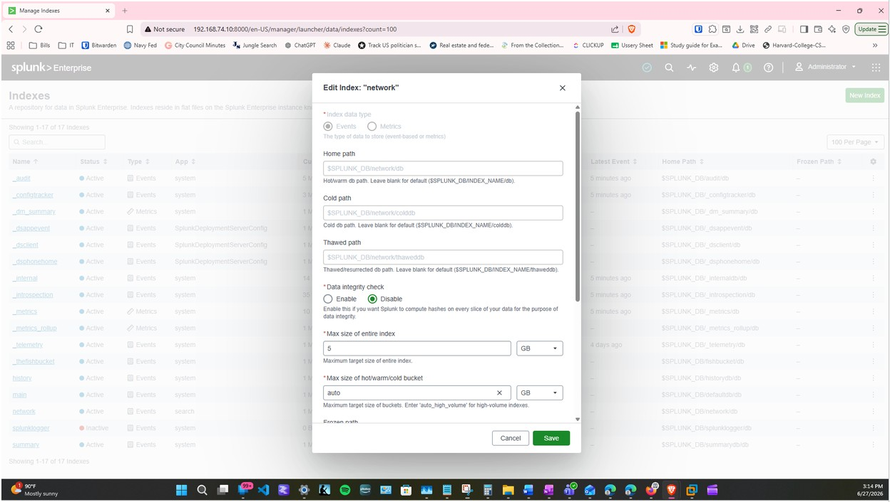
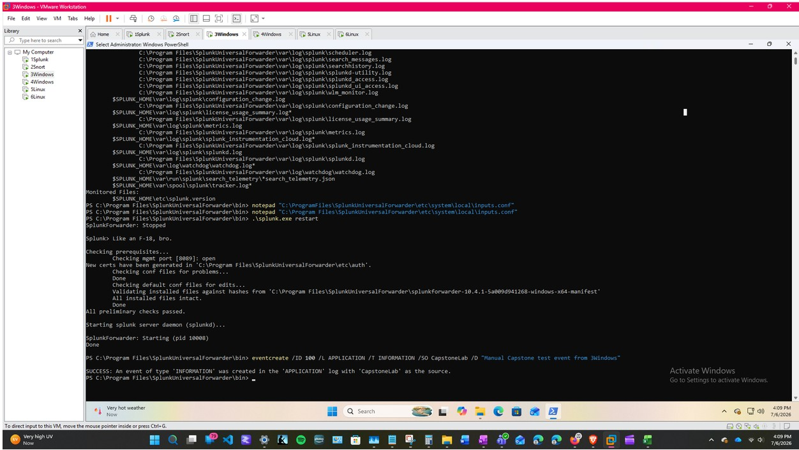
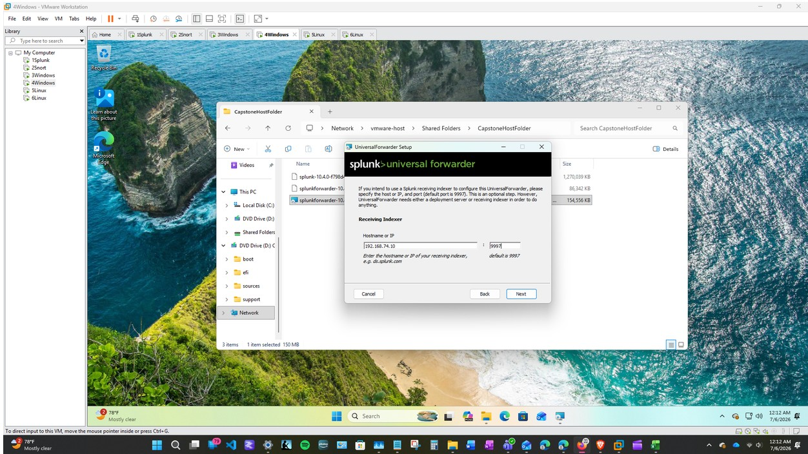
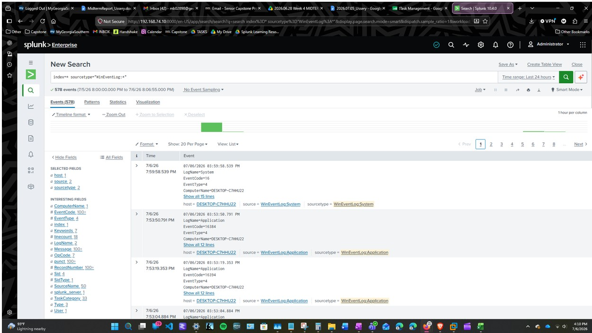

# Log Sources

## Overview

The lab collected endpoint, system, authentication, PowerShell, and intrusion-detection data from multiple virtual machines.

Splunk Universal Forwarders monitored the configured log sources and sent the resulting events to the central Splunk server at:

```text
192.168.74.10:9997
```

The data was separated into the `windows`, `linux`, and `network` indexes according to the type and source of the activity.

## Splunk Receiving Port



*Figure 3. Splunk configured to receive forwarded data on port `9997`.*

## Splunk Indexes

| Index | Purpose |
|---|---|
| `windows` | Stores Windows Event Log and PowerShell activity |
| `linux` | Stores Linux authentication and system activity |
| `network` | Stores Snort IDS alerts and network-related events |

## Index Configuration



*Figure 4. The `network` index created for Snort and network events.*

## Log Source Inventory

| Source System | Log Source | Splunk Index | Sourcetype | Purpose |
|---|---|---|---|---|
| `3Windows` | Windows Application Log | `windows` | `WinEventLog:Application` | Application events and manually generated Windows test events |
| `3Windows` | Windows Security Log | `windows` | `WinEventLog:Security` | Authentication, account, and security-related Windows events |
| `3Windows` | PowerShell Operational Log | `windows` | `WinEventLog:Microsoft-Windows-PowerShell/Operational` | PowerShell command and script activity |
| `4Windows` | Windows Event Logs | `windows` | Windows event sourcetypes | Server and Windows event collection |
| `5Linux` | `/var/log/auth.log` | `linux` | `linux_secure` | SSH, login, sudo, and authentication activity |
| `5Linux` | `/var/log/syslog` | `linux` | `syslog` | General Linux system activity |
| `6Linux` | Linux authentication and system logs | `linux` | Linux sourcetypes | Testing-machine authentication and system activity |
| `2Snort` | `/var/log/snort/alert` | `network` | `snort` | Snort intrusion-detection alerts |

## Windows Log Collection

### Application Log

The Windows Application Log was monitored to collect application-related events and controlled test events generated on `3Windows`.

```conf
[WinEventLog://Application]
disabled = false
index = windows
```

A manual test event was generated using the Windows `eventcreate` command and reviewed through the `windows` index.



*Figure 8. Manual Application Log event generated on `3Windows` using `eventcreate`.*

### Security Log

The Windows Security Log was included to collect authentication, logon, account, and other security-related events.

```conf
[WinEventLog://Security]
disabled = false
index = windows
```

This log source is relevant to activity such as:

- Failed Windows logins
- Account creation
- Account deletion
- Security-group membership changes
- Successful and failed authentication

The amount of evidence available depends on the Windows audit policies enabled before the activity occurs.

### PowerShell Operational Log

The PowerShell Operational Log was enabled and collected from `3Windows`.

```conf
[WinEventLog://Microsoft-Windows-PowerShell/Operational]
disabled = false
index = windows
```

Additional PowerShell visibility was enabled through:

- Script Block Logging
- Module Logging
- The Microsoft Windows PowerShell Operational Log

This log source was used to review PowerShell activity associated with account changes, file operations, and controlled command execution.

## Linux Log Collection

### Authentication Log

The Linux authentication log was monitored using:

```conf
[monitor:///var/log/auth.log]
disabled = false
index = linux
sourcetype = linux_secure
```

This log provided visibility into activity such as:

- SSH connection attempts
- Failed authentication
- Successful authentication
- Invalid usernames
- `sudo` activity
- Linux login activity

### System Log

The Linux system log was monitored using:

```conf
[monitor:///var/log/syslog]
disabled = false
index = linux
sourcetype = syslog
```

This source provided general operating-system and service activity from the Linux endpoint.

## Snort Alert Collection

The active Snort alert file was monitored using:

```conf
[monitor:///var/log/snort/alert]
disabled = false
index = network
sourcetype = snort
```

The alert file contained readable IDS events generated when observed traffic matched an active Snort rule.

The Snort events were forwarded to the `network` index for review in Splunk.

## Forwarding Configuration

The Splunk Universal Forwarders sent collected data to the central Splunk server using port `9997`.

```conf
[tcpout]
defaultGroup = splunk_indexers

[tcpout:splunk_indexers]
server = 192.168.74.10:9997

[tcpout-server://192.168.74.10:9997]
```

## Forwarder Connection



*Figure 5. Splunk Universal Forwarder connected to the central indexer.*

## Validation Searches

Broad searches were initially used to confirm that data was entering each index.

### Windows Events

```spl
index=windows
```

### Linux Events

```spl
index=linux
```

### Network Events

```spl
index=network
```

### PowerShell Operational Events

```spl
index=windows sourcetype="WinEventLog:Microsoft-Windows-PowerShell/Operational"
```

### Snort Alerts

```spl
index=network sourcetype=snort
```

After confirming ingestion, searches were narrowed using the host, sourcetype, username, event details, keywords, and applicable time range.



*Figure 9. Windows Event Log data from `3Windows` displayed in Splunk.*

## Validation Considerations

A configured log source should not be considered fully operational until the entire collection path has been verified:

1. The source system generates an event.
2. The event appears in the expected local log.
3. The Splunk Universal Forwarder monitors the correct source.
4. The forwarder connects to `1Splunk`.
5. Splunk stores the event in the intended index.
6. The event can be located and interpreted through a search.

This validation process helped distinguish between a configured log source and a log source that was confirmed to be producing searchable data.

## Related Configuration Files

The corresponding configuration files are available in the `configurations` folder:

- `windows-inputs.conf`
- `linux-inputs.conf`
- `snort-inputs.conf`
- `outputs.conf`
- `enable-powershell-logging.md`
