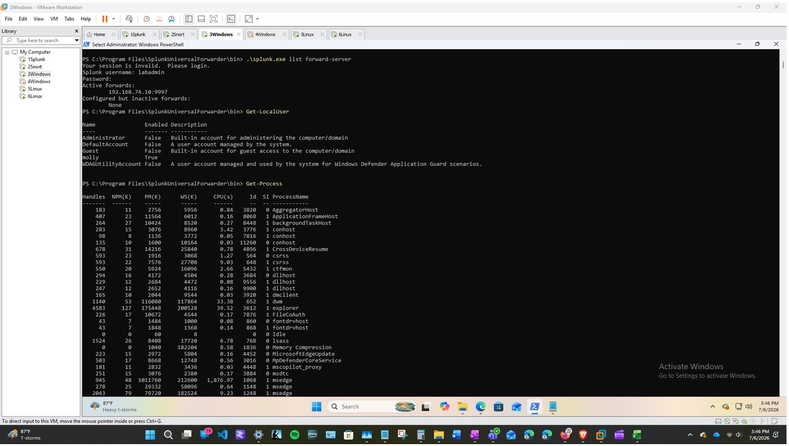

# Suspicious PowerShell Activity

## Purpose

The purpose of this test was to verify that PowerShell commands executed on a Windows endpoint were recorded and searchable in Splunk.

## Source System

| System | Role | IP Address |
|---|---|---|
| `1Splunk` | SIEM used to collect and review the resulting logs | `192.168.74.10` |
| `3Windows` | Windows user workstation used to generate PowerShell activity | `192.168.74.30` |

## Logging Configuration

PowerShell logging was enabled on `3Windows` before the test activity was generated.

The configuration included:

- PowerShell Script Block Logging
- PowerShell Module Logging
- The Microsoft Windows PowerShell Operational Log
- Splunk Universal Forwarder monitoring of PowerShell Operational events

These settings provided greater visibility into the PowerShell commands executed on the workstation.

## Test Activity

PowerShell commands were submitted on `3Windows` to generate controlled activity for review in Splunk.

The test was designed to confirm that the enabled PowerShell logging configuration recorded the commands and forwarded the resulting events to the Splunk `windows` index. The final report documents that test PowerShell activity was generated, but it does not preserve every exact command entered during this portion of testing. 



*Figure 11. PowerShell `Get-Process` activity from `3Windows` recorded in the PowerShell Operational Log and displayed in Splunk.*

## Log Source

The activity was collected from:

```text
Microsoft-Windows-PowerShell/Operational
```

The corresponding Splunk sourcetype was:

```text
WinEventLog:Microsoft-Windows-PowerShell/Operational
```

The PowerShell Operational Log was successfully validated as a completed log source in the lab. 

## Splunk Search

```spl
index=* sourcetype="WinEventLog:Microsoft-Windows-PowerShell/Operational"
```

This search locates events collected from the PowerShell Operational Log.

The search can also be limited to the Windows index:

```spl
index=windows sourcetype="WinEventLog:Microsoft-Windows-PowerShell/Operational"
```

## Expected Evidence

The search results should show:

- PowerShell Operational events from `3Windows`
- The time the activity occurred
- Event details associated with the executed PowerShell commands
- Evidence that the Windows endpoint successfully forwarded the activity to Splunk

## Analyst Interpretation

PowerShell is a legitimate Windows administration tool, but it may also be used to execute unauthorized scripts or commands.

PowerShell activity is not automatically malicious. A security analyst should review:

- The command or script content
- The user who executed it
- The source endpoint
- The execution time
- Related process, account, network, or file activity
- Whether the activity was expected and authorized

Script Block Logging and Module Logging provide additional context that can help distinguish ordinary administrative activity from potentially suspicious behavior.

## Result

The test confirmed that PowerShell activity generated on `3Windows` was recorded through the PowerShell Operational Log, forwarded to Splunk, and searchable as Windows event data.


---

### *About This Project*

**Created by Molly Bentley Ussery | Senior Capstone Project | July 2026**

This project documents hands-on cybersecurity work completed in a six-system Splunk + Snort SOC lab, including security monitoring, detection, attack simulation, investigation, and analyst documentation.

🔗 **Quick Links** *| [Cybersecurity Portfolio](https://mbbu-beep.github.io/) | [Project Home](https://github.com/mbbu-beep/splunk-snort-soc-lab) | [Video Demo](https://github.com/mbbu-beep/splunk-snort-soc-lab/blob/main/documentation/video-demo.md) | [Cybersecurity Insights](https://github.com/mbbu-beep/cybersecurity-insights) | [LinkedIn](https://www.linkedin.com/in/mollybbussery/) |* 🔒
