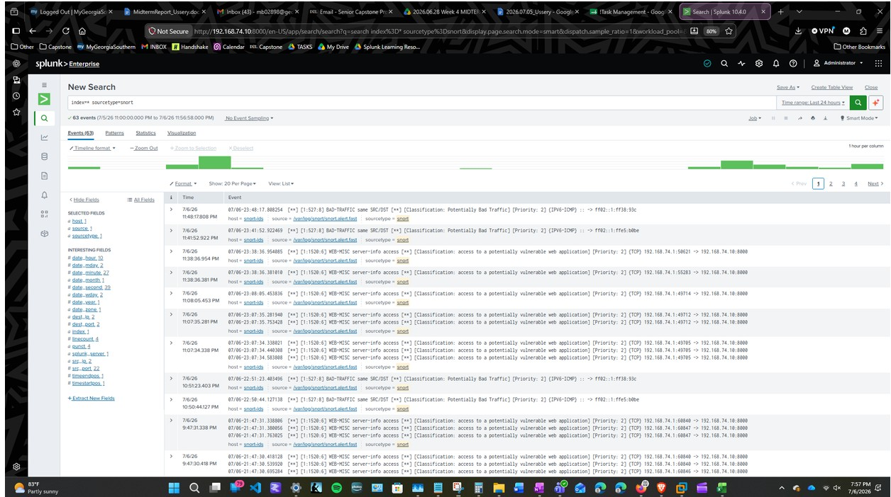

# Snort IDS Alerts

## Purpose

The purpose of this test was to verify that network traffic matching a configured Snort rule generated an IDS alert and that the alert was forwarded to Splunk for review.

## Source and Monitoring Systems

| System | Role | IP Address |
|---|---|---|
| `1Splunk` | SIEM used to collect and review Snort alerts | `192.168.74.10` |
| `2Snort` | IDS sensor used to inspect network traffic and generate alerts | `192.168.74.20` |
| `3Windows` | Windows user workstation | `192.168.74.30` |
| `4Windows` | Domain/server system available for future testing | `192.168.74.40` |
| `5Linux` | Linux endpoint and possible traffic target | `192.168.74.50` |
| `6Linux` | Attack and testing machine used to generate network traffic | `192.168.74.60` |

## Snort Rule

A custom Snort rule was configured to detect ICMP traffic directed toward the protected lab network.

```conf
alert icmp any any -> $HOME_NET any (msg:"ICMP Ping Detected"; sid:1000001; rev:1;)
```

A complete breakdown of this rule is available in [Snort Local Rule Configuration](../configurations/snort-local.md).

## Test Activity

Network traffic was generated from `6Linux` within the isolated VMware environment. The traffic was designed to match the configured Snort rule and produce an IDS alert.

Snort inspected the traffic on `2Snort` and generated an alert when the rule conditions were met.

## Alert Collection

The Snort alert log was monitored by the Splunk Universal Forwarder on `2Snort`.

The forwarder sent the alert data to the Splunk server at:

```text
192.168.74.10:9997
```

The events were stored in the Splunk `network` index using the custom `snort` sourcetype.

## Splunk Search

The validation search used for Snort data was:

```spl
index=* sourcetype=snort
```

The search may also be limited to the designated network index:

```spl
index=network sourcetype=snort
```

The time range should be adjusted to match the period when the test traffic was generated.



*Figure 13. Snort IDS alerts from `2Snort` displayed in the Splunk `network` index.*

## Expected Evidence

The results should show:

- An alert generated by `2Snort`
- The custom alert message
- The Snort signature ID
- The source and destination addresses associated with the traffic
- The protocol detected by the rule
- The date and time of the alert
- The event stored in the Splunk `network` index

## Analyst Interpretation

A Snort alert means that observed traffic matched the conditions of an enabled detection rule. It does not automatically prove that malicious activity occurred.

An analyst should review:

- The alert message and signature ID
- The source and destination IP addresses
- The protocol and direction of the traffic
- The number and frequency of similar alerts
- Other endpoint or network events from the same time
- Whether the activity was expected or authorized

In this test, the traffic was intentionally generated inside the controlled lab. In a business environment, an unexpected alert would require additional investigation and supporting evidence.

## Result

The test confirmed that Snort could inspect lab traffic, generate an alert based on a configured rule, and forward the resulting event to Splunk for analysis.

It also demonstrated that Snort only identifies activity covered by its active configuration and detection rules.

## Screenshot Evidence

*Screenshots will be added beside the applicable test activity and Splunk search after the event is reproduced or located in the existing project evidence.*
